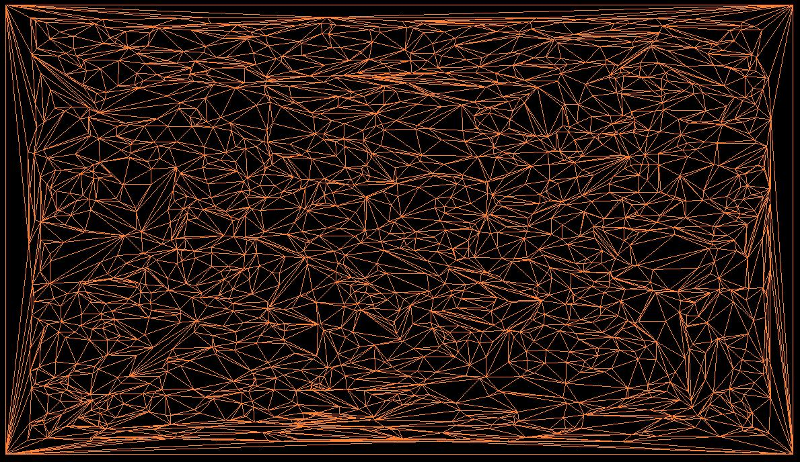

# Incremental Delaunay Triangulation visualization

Incremental Delaunay triangulation with visualization. It was implemented using C++, CMake, imgui, glm, gl3w and glfw. It is the first assignement in the course CC5501-1 Mallas Geométricas y Aplicaciones, of the University Of Chile.

## Screenshots



## Getting Started

These instructions will get you a copy of the project up and running on your local machine.

### Prerequisites

To run the project, you will need to have installed glfw library in your computer. If you have a ubuntu distro, you only need to run:

```
sudo apt-get install libglfw3
sudo apt-get install libglfw3-dev
```

Other than that, you only need a graphics card capable to run OpenGL 3.2 core profile, CMake (version 3.1 or more) and a C++ compiler capable to compile C++11 (g++-4.8 or more works).

### Installing

```
git clone https://github.com/hporro/Tarea1Mallas
cd Tarea1Mallas
mkdir build
cd build
cmake ..
cmake --build .
```

### Running

Then you can run the main application running the main executable file, in the build directory:

```
./main
```

## Running the tests

To run the tests, you have to run the tests executable in the build folder:

```
./tests
```

## Built With

* [CMake](https://cmake.org/) - Build system for C++ compilation
* [gl3w](https://github.com/skaslev/gl3w) - OpenGL context loader library
* [imgui](https://github.com/ocornut/imgui) - GUI library
* [GLFW](https://github.com/glfw/glfw) - Window manager library for OpenGL context
* [tinytest](https://github.com/joewalnes/tinytest) - Simple header only test framework

## Authors

* **Heinich Porro** - *He made the work* - [hporro](https://github.com/hporro)

## License

This project is licensed under the MIT License - see the [LICENSE.md](LICENSE.md) file for details

## Acknowledgments

* Thanks to https://www.gitignore.io/ for the generated .gitignore.
* Thanks to [JoeyDeVries](https://learnopengl.com/Getting-started/Hello-Triangle) for the OpenGL tutorial, and the Shader class.