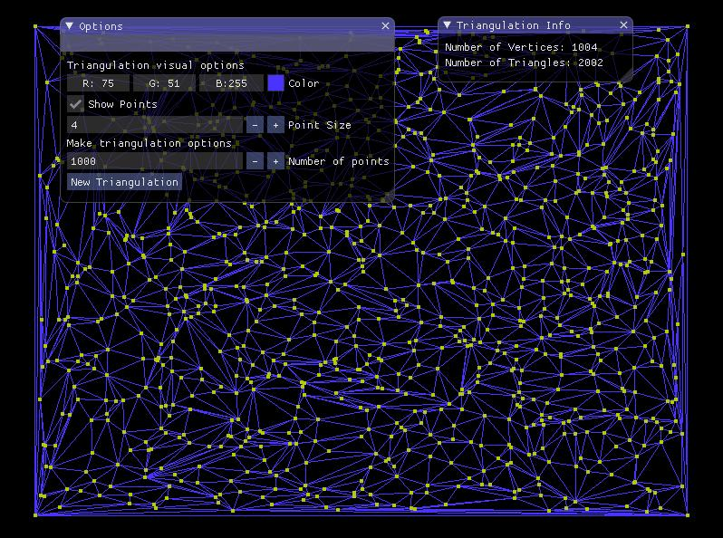
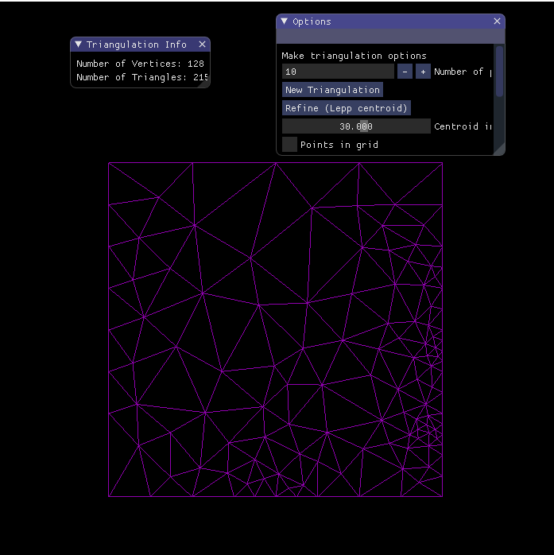

# Incremental Delaunay Triangulation visualization

Incremental Delaunay triangulation with visualization. It was implemented using C++, CMake, imgui, glm, gl3w and glfw. It is the first assignement in the course CC5501-1 Mallas Geométricas y Aplicaciones, of the University Of Chile.

## Screenshots




## Getting Started (Ubuntu)

These instructions will get you a copy of the project up and running on your local ubuntu machine.

### Prerequisites 

You only need a graphics card capable to run OpenGL 3.2 core profile, CMake (version 3.1 or more) and a C++ compiler capable to compile C++11 (g++-4.8 or more works).

### Installing

```
cd Tarea1Mallas
mkdir build
cd build
cmake ..
cmake --build .
```

### Running

Then you can run the main application running the main executable file, in the build directory:

```
./main
```

## Running the tests

To run the tests, you have to run the tests executable in the build folder:

```
./tests
```

## Getting Started (Windows)

These instructions will get you a copy of the project up and running on your local Windows machine.

### Prerequisites

This project have been run in Visual Studio 2019, but it should also work in Visual Studio 2017 because the support fot CMake in both of those versions works as good as the other. Also, you need a graphics card capable to run OpenGL 3.2 core profile.

### Installing

You just need to open the project in visual studio, the libraries needed are included in the repository.

### Running

To run the project you can do `ctrl+shift+B` to compile all the code (this might take a while as it compiles GLFW too), and then you have to select the `main.exe` executable in the top tool bar. 

## Running the tests
As you selected the `main.exe` executable, you can select the `tests.exe` executable to run the tests.

## Built With

* [CMake](https://cmake.org/) - Build system for C++ compilation
* [gl3w](https://github.com/skaslev/gl3w) - OpenGL context loader library
* [imgui](https://github.com/ocornut/imgui) - GUI library
* [GLFW](https://github.com/glfw/glfw) - Window manager library for OpenGL context
* [tinytest](https://github.com/joewalnes/tinytest) - Simple header only test framework

## Algorithms implemented

The following algorithms are implemented in this project:

* Incremental Delaunay triangulation construction. This is a classic algorithm in the literature.
* Lepp centroid mesh improvement algorithm. This algorithm is fully described in the paper called "Terminal triangles centroid algorithms for quality Delaunay triangulation" Authored by Rivara and Diaz.

## Authors

* **Heinich Porro** - *He made the work* - [hporro](https://github.com/hporro)

## License

This project is licensed under the MIT License - see the [LICENSE.md](LICENSE.md) file for details

## Acknowledgments

* Thanks to https://www.gitignore.io/ for the generated .gitignore.
* Thanks to [JoeyDeVries](https://learnopengl.com/Getting-started/Hello-Triangle) for the OpenGL tutorial, and the Shader class.
* Thanks to Benjamin Mellado, for checking this homework Uwu.